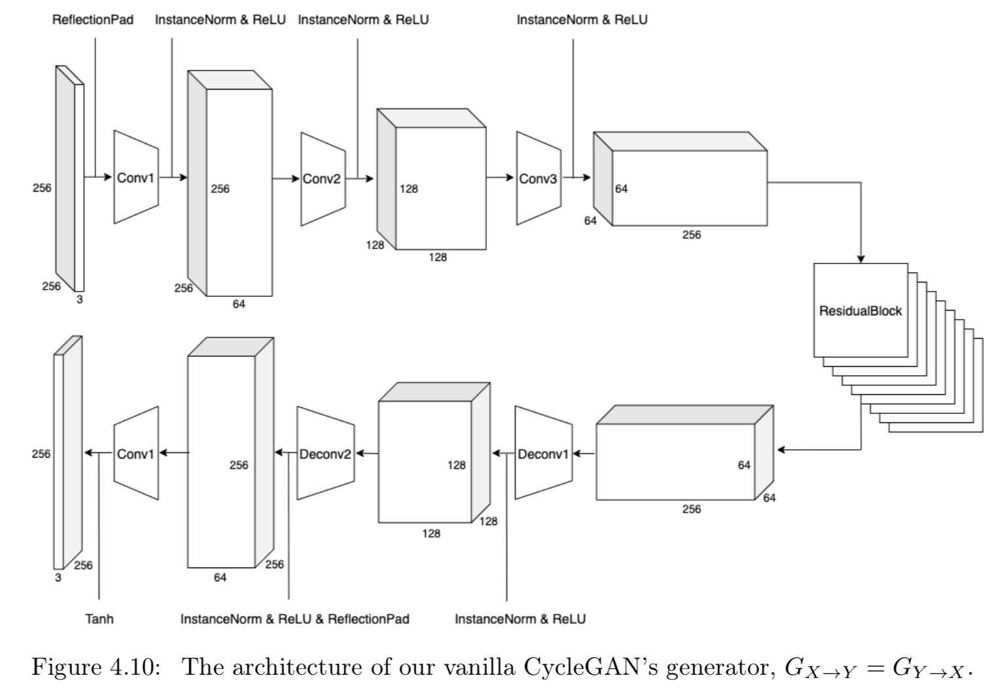
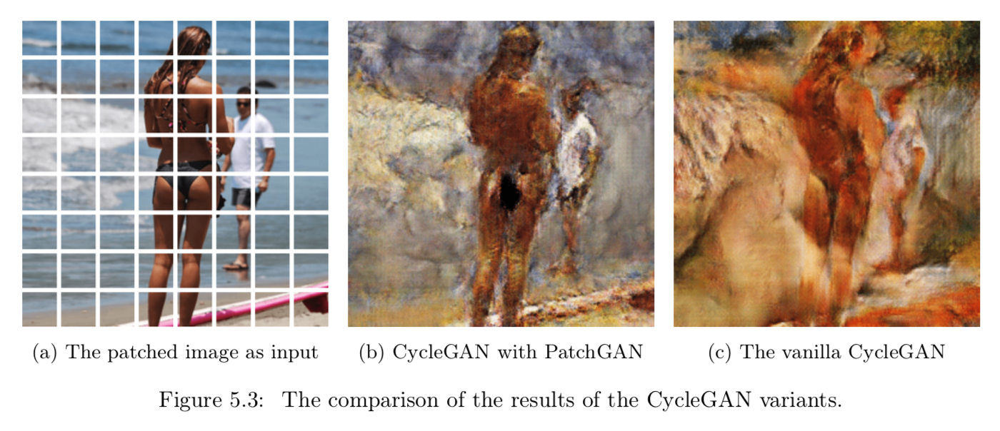
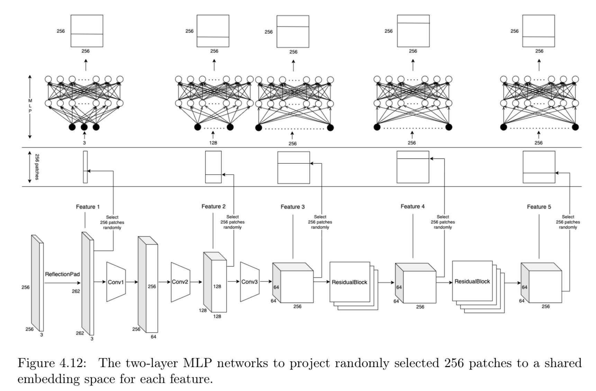
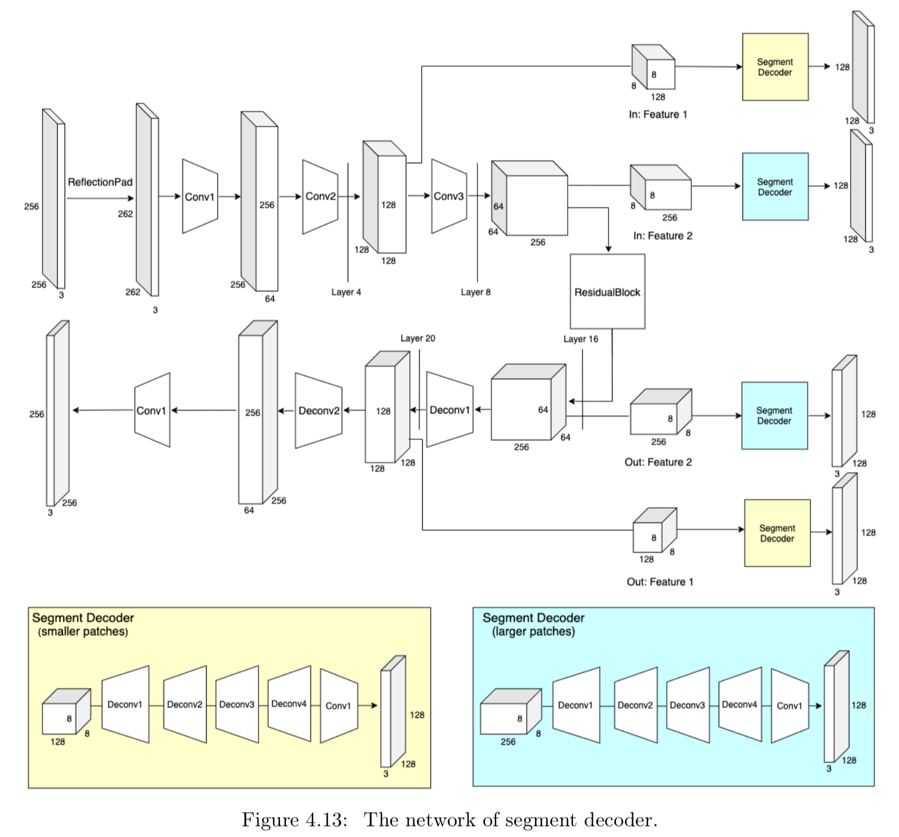
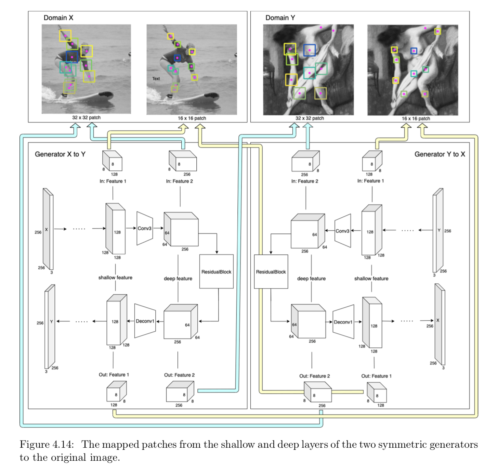
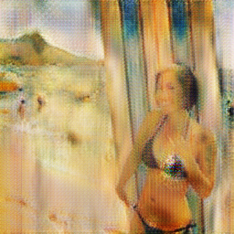
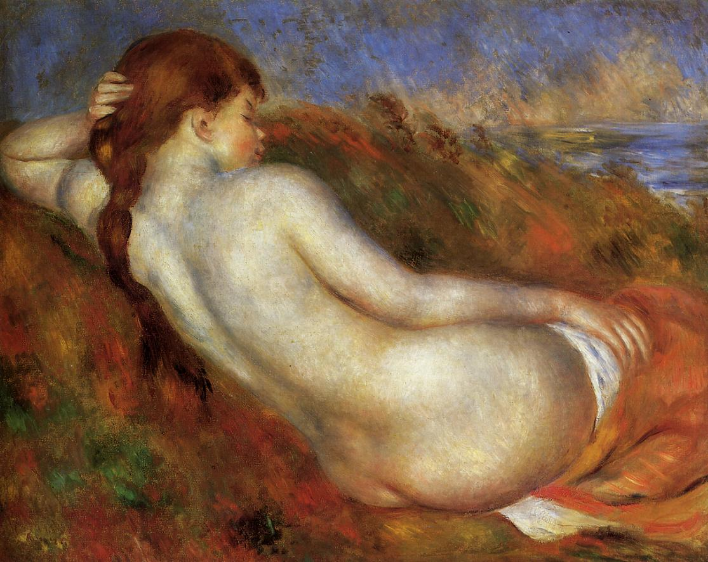
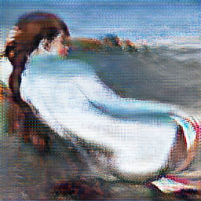

# Pose CycleGAN

## Architecture

### Vanilla Generator and Discriminator

<p float="left">
    
    
</p>

### Discriminator with PatchGAN

<p float="left">
    
</p>

### Generator with MLP (Contrastive Learning)

<p float="left">
    
</p>

### Segment Loss

<p float="left">
    
    
</p>

## Dataset

Download the chosen dataset:
* apple2orange
* horse2zebra (buggy: some images don't have the RGB channel)
```bash
./download_dataset apple2orange
```

```
├── datasets                   
|   ├── <dataset_name>         # i.e. apple2orange
|   |   ├── train              # Training
|   |   |   ├── A              # Contains domain A images (i.e., Apple)
|   |   |   └── B              # Contains domain B images (i.e., Orange)
|   |   └── test               # Testing
|   |   |   ├── A              # Contains domain A images (i.e., Apple)
|   |   |   └── B              # Contains domain B images (i.e., Orange)
```

## Usage

### Training

```bash
python train.py --dataset apple2orange --cuda --n_epochs 20 --decay_epoch 10
```

<p float="left">
    
</p>

### Testing

```bash
python test.py --dataset apple2orange --cuda
```

### Generate

```bash
python generate.py --input_img pix/surf.jpg --generator A2B
python generate.py --input_img pix/nude.jpg --generator B2A
```

<p float="left">
    
    
</p>

<p float="left">
    
    
</p>

### Losses

<p float="left">
    
</p>

## References

* https://pytorch.org/docs/stable/generated/torch.nn.CrossEntropyLoss.html
* https://docs.scipy.org/doc/scipy/reference/generated/scipy.stats.wasserstein_distance.html
* https://stackoverflow.com/questions/53970733/i-want-to-compute-the-distance-between-two-numpy-histogram
* https://stackoverflow.com/questions/34884779/whats-a-simple-way-of-warping-an-image-with-a-given-set-of-points
* https://stackoverflow.com/questions/5071063/is-there-a-library-for-image-warping-image-morphing-for-python-with-controlled
* https://legacy.imagemagick.org/Usage/distorts/#shepards